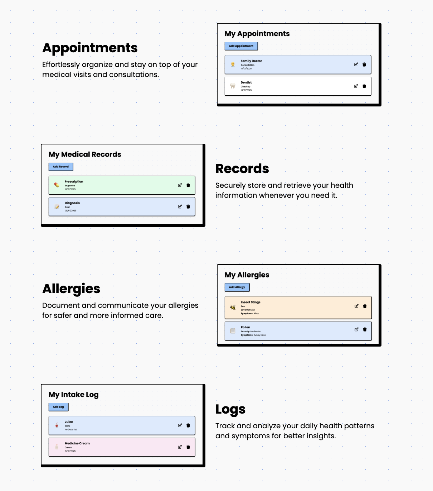
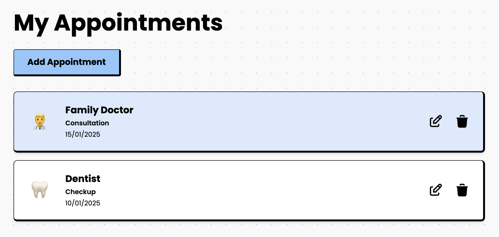
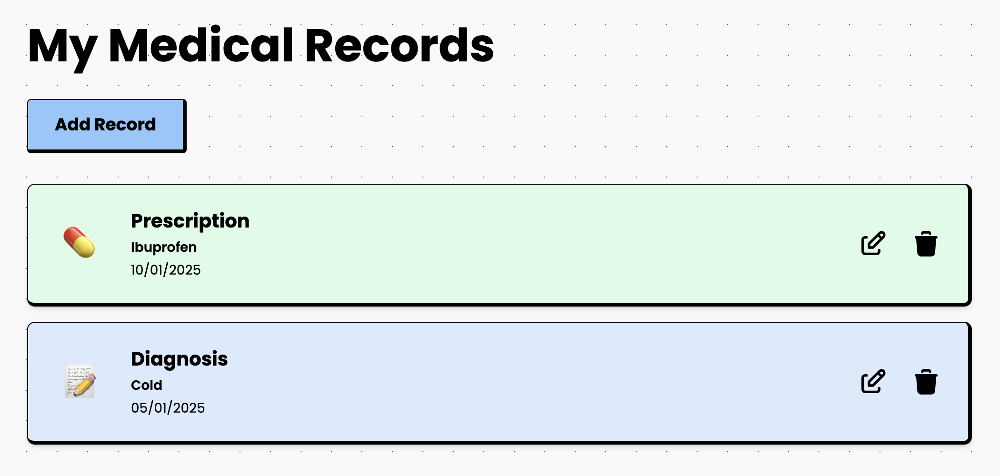
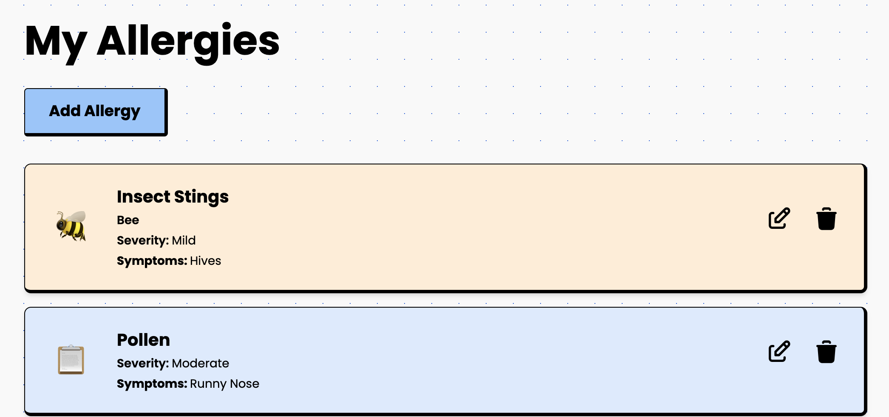
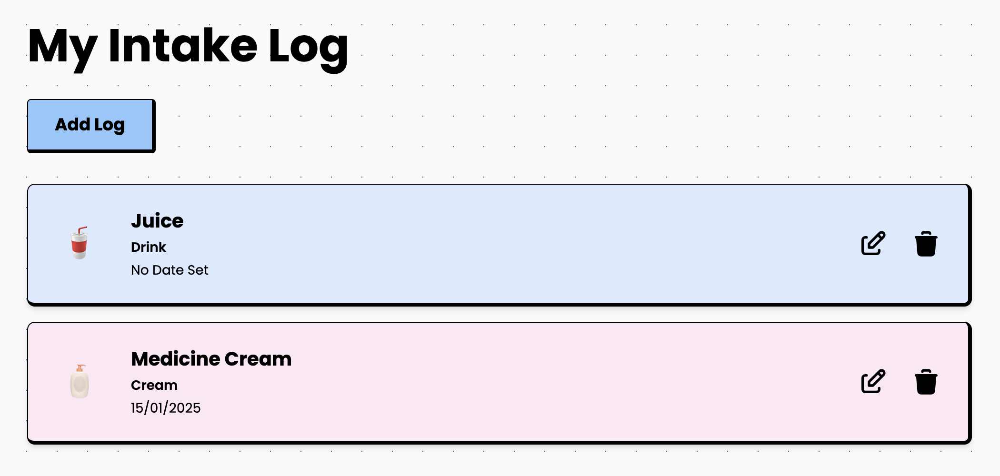

# Medicolog

Medicolog is a web application designed to help users manage their health-related data, including appointments, medical records, allergies, and health logs. It provides a centralized platform for organizing and accessing personal health information.

## Features

- **Appointments**: Organize and manage medical visits and consultations.
- **Records**: Securely store and retrieve health information.
- **Allergies:** Document and communicate allergy information.
- **Logs**: Track and analyze daily health patterns and symptoms.

